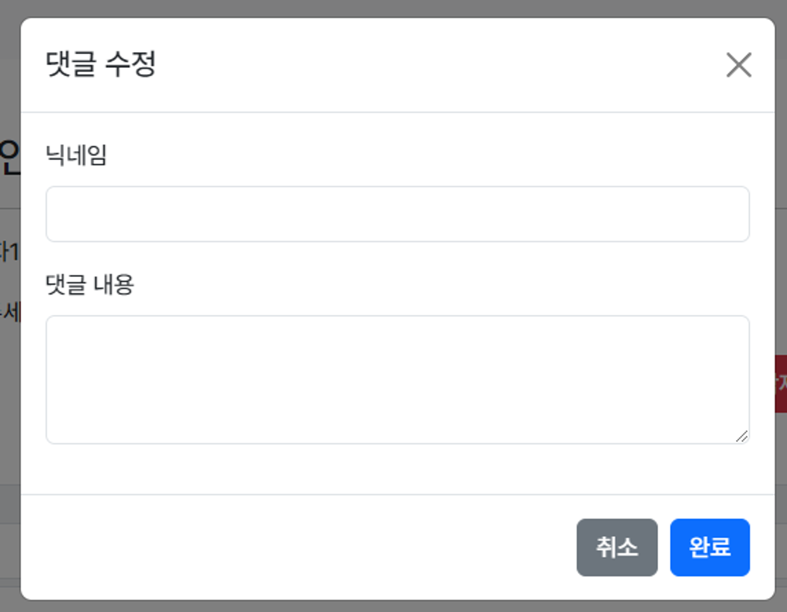

!

!
_list.mustache

버튼의 속성으로 데이터터를 저장함

버튼 속성의 데이터를 받으면 이를 모달(수정 폼)에 출력해야된다. 이를 모달 이벤트 처리라고 한다.

먼저 `querySelector`로 모달을 선택한다.

```jsx
<script>
{
    // 모달 요소 선택
    const commentEditModal = document.querySelector("#comment-edit-modal");
}
</script>

```

모달이 이벤트를 감지하고 있다가 이벤트가 발생하면 기존 댓글을 받아온다.

```jsx
// 모달 이벤트 감지
commentEdit.addEventListener("show.bs.modal", function(event) {});
```

함수 내부는

1. 트리거 버튼 선택
2. 데이터 가져오기
3. 수정 폼에 데이터 반영

순으로 진행된다.

```jsx
    // 모달 이벤트 감지
    commentEdit.addEventListener("show.bs.modal", function(event) {
        // 1. 트리거 버튼 선택
        const triggerBtn = event.relatedTarget;
        // 2. 데이터 가져오기
        const id = triggerBtn.getAttribute("data-bs-id");
        const nickname = triggerBtn.getAttribute("data-bs-nickname");
        const body = triggerBtn.getAttribute("data-bs-body");
        const postId = triggerBtn.getAttribute("data-bs-post-id");
        // 3. 수정 폼에 데이터 반영
        document.querySelector("#edit-comment-nickname").value = nickname;
        document.querySelector("#edit-comment-body").value = body;
        document.querySelector("#edit-comment-id").value = id;
        document.querySelector("#edit-comment-post-id").value = postId; 
        

    });
```

1. funtion으로 받은 event에서 `relatedTarget`을 통해 트리거를 `triggerBtn`에 저장한다.
2. 트리거의 속성 값은 `getAttribute`값으로 가져온다.
3. `querySelector` 로 입력 폼을 선택하고 해당 요소의 값들을 넣는다.


